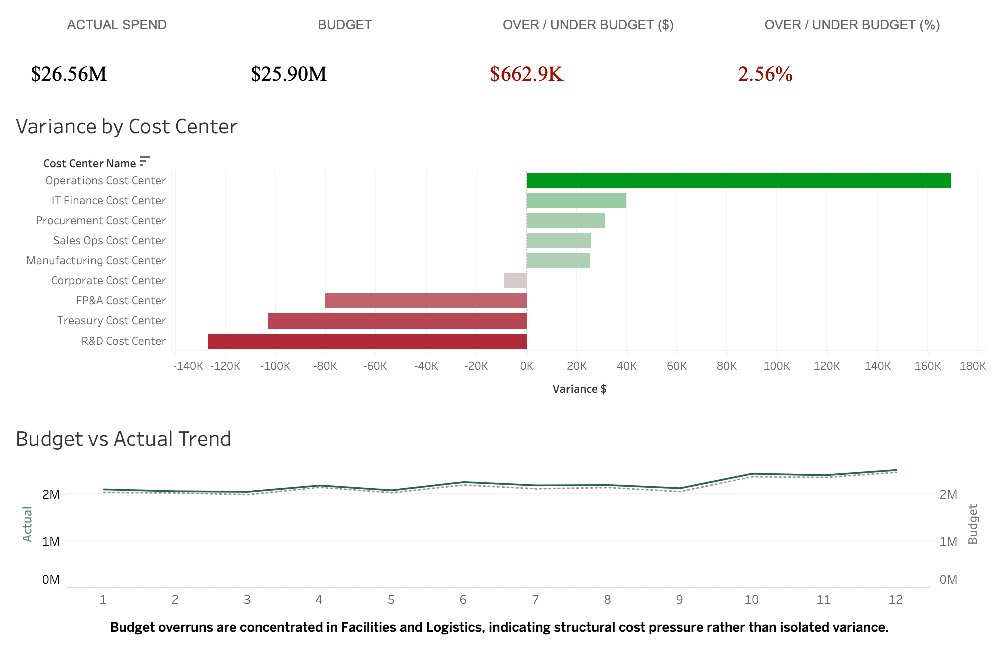
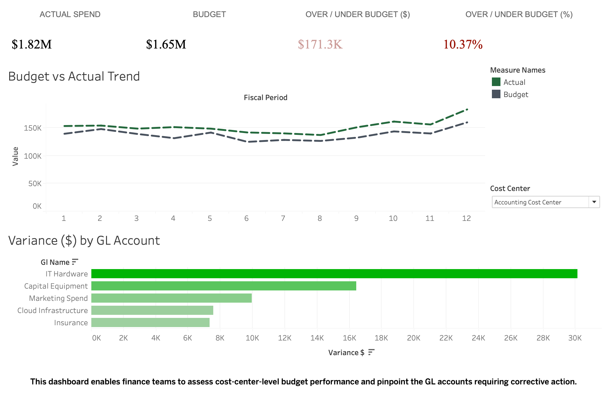
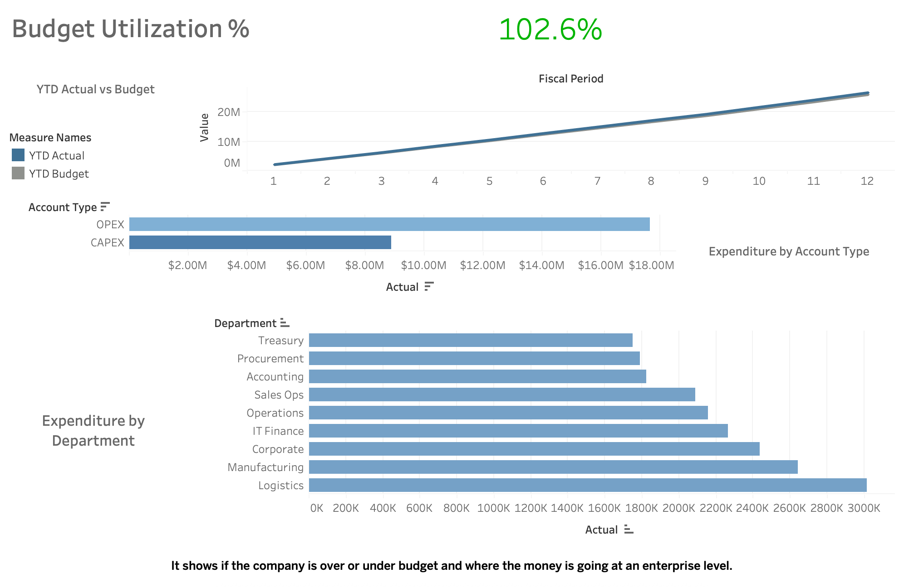

# Finance Performance & Budget Analytics

## Overview
This project delivers an end-to-end finance analytics solution that replicates how enterprise finance and FP&A teams monitor budget performance, analyze cost drivers, and maintain financial control.

Using a SAP-style data model and Tableau dashboards, the solution transforms monthly financial data into executive-ready insights and operational drilldowns.

---

## Tools & Technologies
- Tableau Public (Dashboards & Visualization)
- PostgreSQL (Data modeling & querying)
- SQL (Data validation & aggregation)
- CSV-based simulated SAP finance data
- GitHub (Version control & documentation)

---

## Data Model
The data model is structured around a monthly finance mart and supporting dimensions:
- Finance mart (monthly actuals and budgets)
- Cost center hierarchy
- GL account structure
- Department and account type classifications

This mirrors common SAP reporting layers (ECC/S4 → BW → Reporting).

---

## Dashboards (Published on Tableau Public)

### 1. Executive Budget Overview
**Purpose:**  
Provide leadership with a high-level view of budget vs actual performance and key variance drivers.

**Key Insights:**
- Total actual spend vs budget
- Variance ($ and %)
- Monthly performance trends
- Cost centers driving over/under spend

**View Dashboard:**  
https://public.tableau.com/app/profile/maria.pratyusha/viz/FinancePerformanceBudgetAnalytics/ExecutiveKPIVarianceOverview

---

### 2. Cost Center Drilldown
**Purpose:**  
Enable finance partners to analyze budget performance at the cost center level and identify GL-level variance drivers.

**Key Insights:**
- Cost center KPIs
- Monthly budget vs actual trends
- Top GL accounts contributing to variance

**View Dashboard:**  
https://public.tableau.com/app/profile/maria.pratyusha/viz/FinancePerformanceBudgetAnalytics/CostCenterDrilldown

---

### 3. Financial Control & Spend Mix
**Purpose:**  
Support financial planning, governance, and control by providing an enterprise-wide view of spend composition and budget utilization.

**Key Insights:**
- Year-to-date budget utilization
- Cumulative actual vs budget trends
- Spend by account type (OPEX vs CAPEX)
- Spend distribution by department

**View Dashboard:**  
https://public.tableau.com/app/profile/maria.pratyusha/viz/FinancePerformanceBudgetAnalytics/FinancialControlandSpendMix

---

## Process Flow
1. Financial data is generated and structured into a monthly finance mart
2. Data is validated using SQL sanity checks
3. Metrics are calculated consistently across dashboards
4. Tableau sheets are built at the analysis level
5. Dashboards are assembled for executive, FP&A, and finance partner use

---

## Key Takeaways
- Demonstrates end-to-end finance analytics thinking
- Emphasizes trusted metrics and governance
- Mirrors real-world FP&A and enterprise reporting workflows
- Designed for executive decision-making, not just visualization

---

## Notes
- Data used in this project is simulated for demonstration purposes
- Dashboards are designed to reflect real enterprise finance use cases
